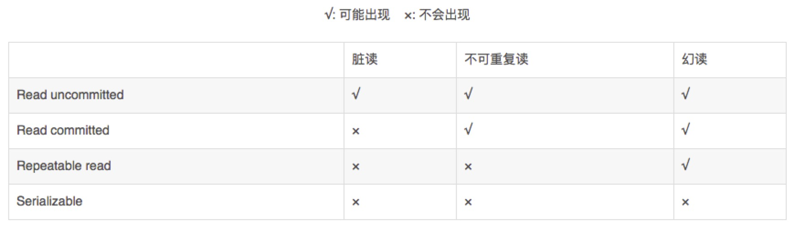

数据库的脏读、不可重复读、幻读都和事务的隔离性有关。所以先了解一下事务的4大特性。
事务的4大特性（ACID）：
```
    原子性(Atomicity)：事务是数据库的逻辑工作单位，它对数据库的修改要么全部执行，要么全部不执行。
    一致性(Consistemcy)：事务前后，数据库的状态都满足所有的完整性约束。
    隔离性(Isolation)：并发执行的N个事务是隔离的，一个不影响一个，一个事务在没有commit之前，被修改的数据不可能被其他事务看到（通过设置数据库的隔离级别）。
    持久性(Durability)：持久性意味着当系统或介质发生故障时，确保已提交事务的更新不能丢失。持久性主要在于DBMS的恢复性能。
```
脏读：
```
    脏读又称无效数据读出。一个事务读取另外一个事务还没有提交的数据叫脏读。

    例如：事务T1修改了一行数据，但是还没有提交，这时候事务T2读取了被事务T1修改后的数据，之后事务T1因为某种原因Rollback了，那么事务T2读取的数据就是脏的。

    解决办法：把数据库的事务隔离级别调整到READ_COMMITTED
```
不可重复读：
```
    不可重复读是指在同一个事务内，两个相同的查询返回了不同的结果。
    例如：事务T1读取某一数据，事务T2读取并修改了该数据，T1为了对读取值进行检验而再次读取该数据，便得到了不同的结果。 解决办法：把数据库的事务隔离级别调整到REPEATABLE_READ
```
幻读：
```
    例如：系统管理员A将数据库中所有学生的成绩从具体分数改为ABCDE等级，但是系统管理员B就在这个时候插入了一条具体分数的记录，当系统管理员A改结束后发现还有一条记录没有改过来，就好像发生了幻觉一样。这就叫幻读。

    解决办法：把数据库的事务隔离级别调整到SERIALIZABLE_READ
```
脏读、不可重复读、幻读的级别高低是：脏读 < 不可重复读 < 幻读。所以，设置了最高级别的SERIALIZABLE_READ就不用在设置REPEATABLE_READ和READ_COMMITTED了

